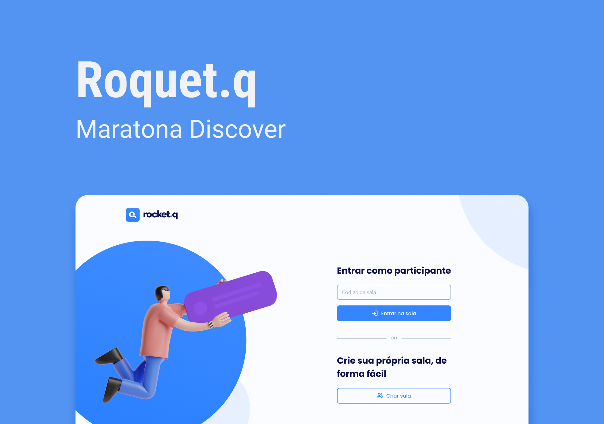

# NLW-project

> <h2> Used tecnologies🖥️ </h2>

<ul>
  <li><a href="https://www.w3.org/standards/webdesign/htmlcss.html">HTML/CSS</a></li>
  <li><a href="https://developer.mozilla.org/pt-BR/docs/Web/JavaScript">JavaScript</a></li>
  <li><a href="https://expressjs.com/">EJS</a></li>
  <li><a href="https://nodejs.org/en/">Node</a></li>
</ul>

> <h2> About the Project🔥 </h2>

RocketQ is a platform where you can ask questions anonymously on private rooms, each room has it's own ID.

> <h2>Final considerations✨</h2>

It was a pleasure to make this project alongside the <a href="https://app.rocketseat.com.br/">Rocketseat team<a>❤️

  
 I'll keep doing some modifications to see what I can do from what I learned with this event. 

